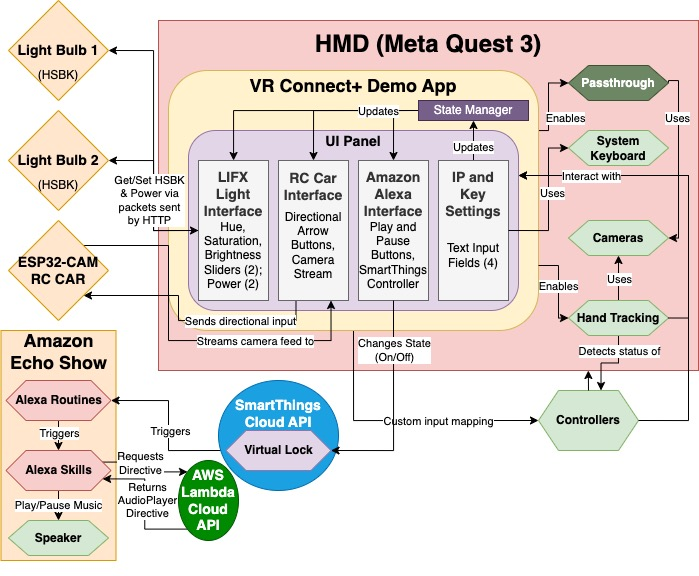

# 🧠 XRConnect+  
### 🎓 A University of Miami Senior Design Project  
**Made by:** Andrew Lamazares, Nate Joseph, and Youssof Alwardany  

> A culmination of four rigorous years at the University of Miami's prestigious College of Engineering.

---

## 🌐 What is XRConnect+?

**XRConnect+** is a platform that bridges **extended reality (XR)** with the **physical world** by enabling real-time interaction with smart devices — all from within a head-mounted display (HMD).

Through **HTTP communication**, XRConnect+ detects devices that a developer has **pre-programmed into their XR application** and establishes live connections. Once connected, the user can control and interact with these devices *directly within the XR environment*, according to the scope and behavior the developer defined.

---

## 🎮 Senior Design Expo Demo

To showcase XRConnect+ at the **University of Miami Senior Design Expo**, we built three fully functional demo use cases:

1. 💡 **Smart Light Control**  
   Users could turn lights on and off and change their color through gaze-based or hand-tracked interaction inside the headset.

2. 🚗 **RC Car with Live Camera Feed**  
   Users could remotely drive an RC car while viewing a **real-time video stream** from the car's front-facing camera inside the XR space.

3. 🎵 **Alexa Voice Integration**  
   Users could activate an Alexa device to play music in the room through contextual interactions in the virtual environment.

> These examples demonstrated XRConnect+'s flexibility and potential for smart home, accessibility, and entertainment applications — even in a constrained demo setting.

---

## 💡 Why We Built It

We believe that **head-mounted displays (HMDs)** will soon become an integral part of everyday life. As their form factor continues to shrink — possibly resembling the **Meta x Ray-Ban smart glasses** — people will start using them not just for entertainment, but for **real-world control, accessibility, and productivity**.

In this future, XR will go beyond simulation — it will **seamlessly interface with our physical environment**. Imagine:

- Looking through your smart glasses at a virtual screen  
- Turning off all the lights in your home  
- Adjusting the thermostat  
- Starting music or locking your doors  
— all without lifting a finger.

We also see massive potential in **assistive applications**. For example, individuals with mobility impairments could use XRConnect+ to control a **helper robot** in their home — and **see through its eyes** as if it were their own. This concept was directly reflected in our Expo demo, where users drove a remote-controlled car and viewed a **real-time video feed** through their HMD — showcasing the very same principle of **remote embodiment** through XR.

That’s the future we’re building toward. **XRConnect+** is our step in merging extended reality with everyday utility — accessible, immersive, and empowering.

---

## 🔧 Key Features

- 🌐 **HTTP-Based Device Detection**  
  Detect and connect to smart devices defined by the developer’s application logic.

- 🎛️ **In-XR Device Control**  
  Interact with physical devices through intuitive interfaces rendered in VR/AR.

- 🎯 **Developer-Defined Scope**  
  Control what devices are accessible and how they're used based on the application's intent.

- 💡 **Modular Use Cases**  
  From smart homes to robotics, XRConnect+ adapts to diverse developer needs.

---

## 🛠️ Technologies Used

- **Unity** – XR development environment
- **C#** – Core application logic and interaction scripting
- **Meta Quest SDK** – Standalone headset integration
- **WebRTC** – Real-time video streaming (for RC car feed)
- **Amazon Alexa** – Music control via voice assistant integration
- **AWS EC2 / Lambda** – Used for secure key-based Alexa control via virtual machines

---

## 📸 Screenshots & Demo

<!-- Replace with actual media links -->
- 
- 

---

## 🧑‍💻 Authors

| Name              | Role                                  | GitHub / LinkedIn         |
|-------------------|----------------------------------------|--------------------------|
| **Andrew Lamazares** | XR integration, networking, systems    | [@andrewgithub](https://github.com/yourusername) [@andrewlinkedin](https://www.linkedin.com/in/andrew-lamazares/)|
| **Nate Joseph**      | Unity development & UX design          | [@nategithub](https://github.com/natejoseph) [@natelinkedin](https://www.linkedin.com/in/nathanieljoseph/)|
| **Youssof Alwardany** | Device communication & microcontroller systems | [@youssoflinkedin](https://www.linkedin.com/in/youssof-alwardany/) |

---

## 🏛️ About the Program

This project was developed as part of the **Senior Design Capstone** at the **University of Miami College of Engineering**, combining coursework in software, hardware, and systems engineering to build a real-world product from scratch.
